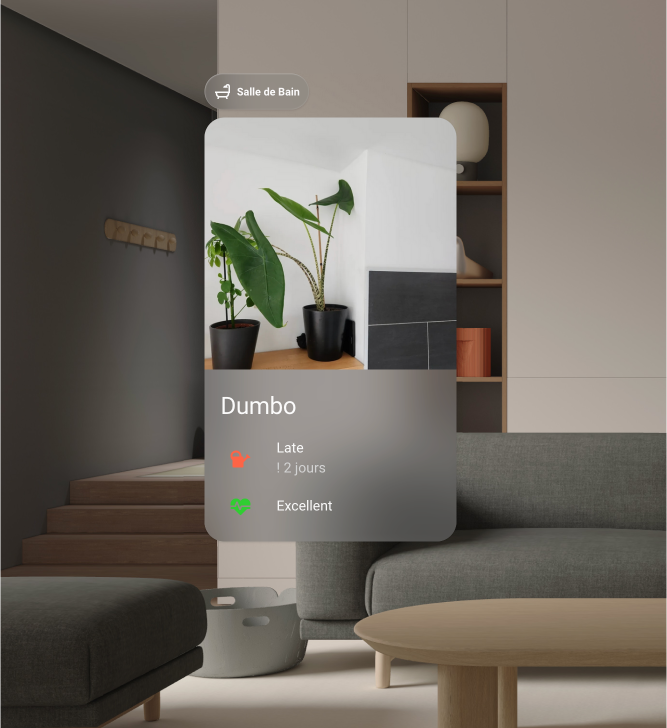

# Simple Plant Card

Simple Plant Card is a custom dashboard card for the [Simple Plant integration](https://github.com/ndesgranges/simple-plant)

This repository exists only to allow installation through HACS (which does not allow both an integration and custom card in the same repository)

> [!IMPORTANT]
> For any issue regarding this custom card, please report it in [the main repository](https://github.com/ndesgranges/simple-plant).

## Installation

OR

1. Install HACS if you don't have it already
2. Open HACS in Home Assistant
3. On the top right side, click the three dot and click `Custom repositories`
4. Where asked for a URL, paste the link of this repository:
https://github.com/ndesgranges/simple-plant-card
1. Where asked for a type, select `dashboard`
2. Click the download button. ⬇️
