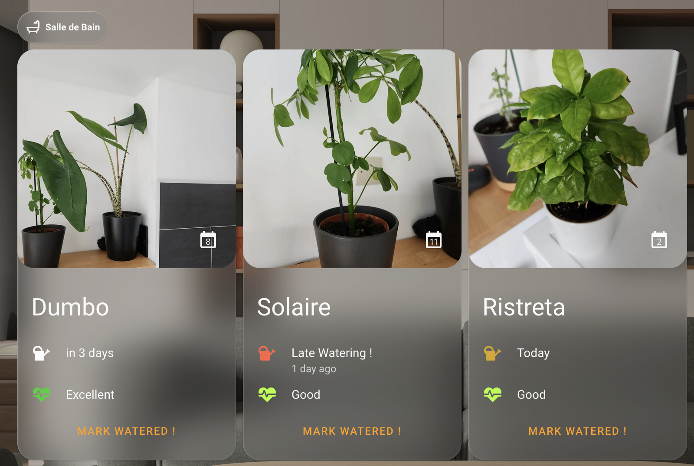

# Simple Plant Card

Simple Plant Card is a custom dashboard card for the [Simple Plant integration](https://github.com/ndesgranges/simple-plant)

This repository exists only to allow installation through HACS (which does not allow both an integration and custom card in the same repository)

For any issue regarding this custom card, please report it in [the main repository](https://github.com/ndesgranges/simple-plant).

## Installation

OR

1. Install HACS if you don't have it already
2. Open HACS in Home Assistant
3. On the top right side, click the three dot and click `Custom repositories`
4. Where asked for a URL, paste the link of this repository:
https://github.com/ndesgranges/simple-plant-card
1. Where asked for a type, select `dashboard`
2. Click the download button. ⬇️
